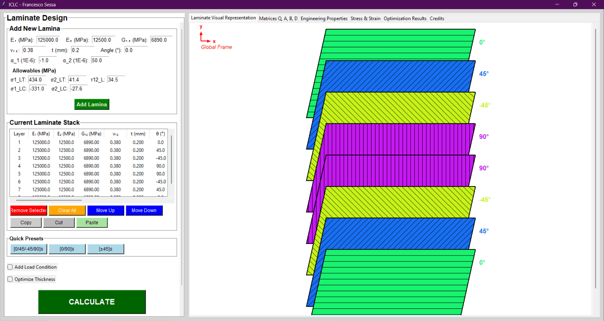
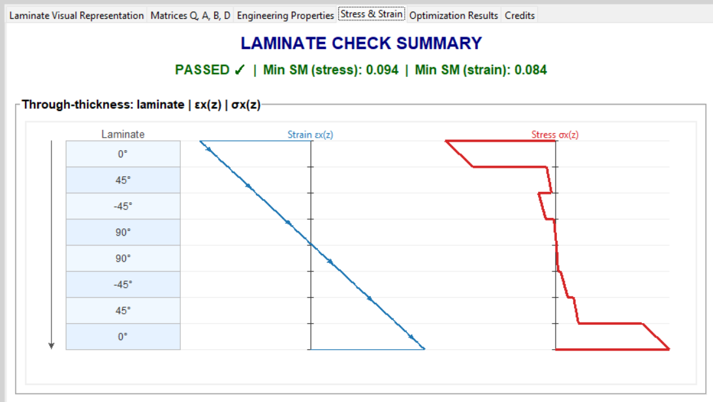

# ICLC: Interactive Composite Laminate Calculator

**A Computational Tool for Composite Laminate Analysis and Optimization**

[](https://github.com/FranciSessa/ICLC---Interactive-Composite-Laminate-Calculator/releases/latest)
[](https://www.python.org/)
[](LICENSE)

## Overview

**ICLC (Interactive Composite Laminate Calculator)** is a specialized engineering tool designed to perform comprehensive analysis and thickness optimization for composite laminates. Developed in Python with a Tkinter GUI, it provides a robust environment for structural engineers and material scientists to design composite stacks using **Classical Lamination Theory (CLT)**.

The tool is available both as a Python script for developers and as a standalone executable for standard users.



## Key Features

* **Laminate Stiffness Analysis:** Computes A, B, and D matrices, inverse stiffness (abcd), and engineering constants ($E_x, E_y, G_{xy}, \nu_{xy}, \dots$).
* **Comprehensive Stress/Strain Check:** Calculates per-ply strains and stresses in both global and local coordinate systems, accounting for mechanical and thermal loads ($\Delta T$).
* **Failure Assessment:** Evaluates structural integrity using **Maximum Stress** and **Maximum Strain** failure criteria, calculating Safety Margins (SM) for every ply.
* **Automated Optimization:** Features a **Sequential Least Squares Programming (SLSQP)** optimizer to automatically adjust ply thicknesses to meet target Safety Margins and thickness constraints.
* **Visual Feedback:** Provides real-time 3D visualization of the stack and through-thickness plots for stress and strain distribution.
* **Data Export:** Exports detailed results and input configurations to `.CSV` format.

## Installation & Usage

### Option 1: Standalone Executable (No Python Required)
If you do not have Python installed, you can simply run the application .exe after unzipping the .zip file that can be downloaded from the release section:
1.  Go to the [Releases](../../releases) page of this repository.
2.  Download the `ICLC.zip` file and unzip it or **[Click here to download the latest ICLC.exe](https://github.com/FranciSessa/ICLC---Interactive-Composite-Laminate-Calculator/releases/latest/download/ICLC.zip)**
3.  Double-click on `ICLC.exe' to run.

### Option 2: Run from Source (For Developers)
1.  **Clone the repository:**
    ```bash
    git clone [https://github.com/FranciSessa/ICLC-Composite-Calculator.git](https://github.com/FranciSessa/ICLC-Composite-Calculator.git)
    cd ICLC-Composite-Calculator
    ```
2.  **Install dependencies:**
    ```bash
    pip install -r requirements.txt
    ```
3.  **Run the application:**
    ```bash
    python ICLC_Main.py
    ```

---

## Theoretical Background

ICLC is built upon the **Classical Lamination Theory (CLT)**.

### Stiffness Computation
The constitutive behavior of the laminate is governed by the [ABD] matrix, relating loads ($N, M$) to mid-plane strains ($\epsilon^0$) and curvatures ($\kappa$):

$$
\begin{Bmatrix} N \\ M \end{Bmatrix} = 
\begin{bmatrix} A & B \\ B & D \end{bmatrix}
\begin{Bmatrix} \epsilon^0 \\ \kappa \end{Bmatrix}
$$

The tool integrates the transformed reduced stiffness matrices ($\bar{Q}$) of individual plies through the laminate thickness $h$:

$$A_{ij} = \sum_{k=1}^{n} (\bar{Q}_{ij})_k (z_k - z_{k-1})$$
$$B_{ij} = \frac{1}{2} \sum_{k=1}^{n} (\bar{Q}_{ij})_k (z_k^2 - z_{k-1}^2)$$
$$D_{ij} = \frac{1}{3} \sum_{k=1}^{n} (\bar{Q}_{ij})_k (z_k^3 - z_{k-1}^3)$$


### Failure Analysis
Total strain is calculated as $\epsilon_{total} = \epsilon^0 + z \cdot \kappa$. The tool isolates mechanical strain by subtracting thermal expansion effects ($\epsilon_{mech} = \epsilon_{total} - \alpha \Delta T$) before checking against allowables.

**Safety Margin (SM)** is reported based on the most critical ply:
$$SM = \frac{\text{Allowable}}{\text{Actual}} - 1$$



### Optimization Logic
ICLC utilizes `scipy.optimize` to perform **Sequential Least Squares Programming (SLSQP)**.
* **Objective:** Minimize thickness (if safe) or maximize safety (if failing).
* **Constraints:** Target Safety Margin ($SM \ge SM_{target}$), Total Thickness limit, and Manufacturing bounds ($t_{min} \le t_{ply} \le t_{max}$).

---

## Workflow

1.  **Define Materials:** Input $E_1, E_2, G_{12}, \nu_{12}$ and allowables in the "Add New Lamina" section.
2.  **Build Stack:** Add plies to the stack. You can use Quick Presets (e.g., Quasi-Isotropic) or copy/paste layers.
3.  **Apply Loads:** Enable "Add Load Condition" to input forces ($N_x...$), moments ($M_x...$), and $\Delta T$.
4.  **Calculate:** Click `CALCULATE` to view matrices, properties, and failure indices.
5.  **Optimize:** (Optional) Enable "Optimize Thickness", set your target SM, and run the calculation again to find the optimal geometry.

## Credits

**Author:** Francesco Sessa  
* [LinkedIn](https://www.linkedin.com/in/francesco-sessa-aer)
* [YouTube](https://www.youtube.com/@francescosessa8861)
* [GitHub](https://github.com/FranciSessa)

## License

This project is open-source. Feel free to use and modify it.
